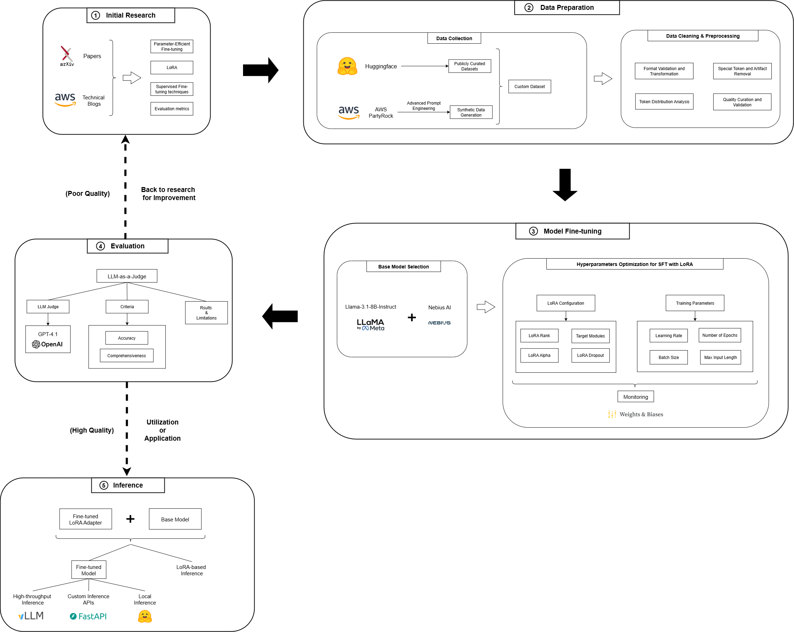

# Domain-Specific Llama SFT for Generative AI Q&A

## About this Project
This project, **Domain-Specific Llama SFT for Generative AI Q&A** was developed following my participation in the **AWS ASEAN LLM League 2025**, an enriching experience hosted by **AI Singapore** and **AWS** for the ASEAN regions.

The core objective of this initiative is to demonstrate the effectiveness of Supervised Fine-Tuning (SFT) on a Llama model to create a highly specialized Q&A system within the domain of generative AI sub-topics.

The AWS ASEAN LLM League competition centers around fine-tuning models with AWS services. For my project, however, I'm exploring and utilizing [Nebius AI Studio](https://studio.nebius.ai/) for this purpose.

---

## Project Structure & Workflow

  

This project is organized into distinct phases, each with its dedicated documentation:

* **Initial Research:** Understanding the problem space and laying the groundwork.
* **Data Preparation:** Curating and processing the domain-specific dataset.
* **Model Fine-Tuning:** The core process of adapting the Llama model.
* **Evaluation:** Assessing the performance of the fine-tuned model.
* **Model Inference:** Performing inference and preparing the merged model for further deployment (vLLM,...).

 

**Notebooks for Model Fine-tuning (Using NebiusAI or UnslothAI)**: [Notebook](./SFT_notebooks/)  
**Scripts for Model Fine-tuning, LLM-as-a-Judge Implementation and Evaluation**: [Scripts](./scripts)  
**Notebook for Model Inference:**: [Notebook](./ft_model_inference/ft_model_inference.ipynb)

---

## Detailed Documented Sections
For in-depth information on each phase, please refer to the dedicated documentation files:

* **Initial Research:** [Read more](./docs/research/)
* **Data Preparation:** [Read more](./docs/data_prep/)
* **Model Fine-Tuning:** [Read more](./docs/model_ft/)
* **Evaluation:** [Read more](./docs/eval/)
* **Model Inference:** [Read more](./docs/model_inference/)

## Future work
- Exploring different models for optimal performance.
- Deployment of the fine-tuned model as an API service.

## Acknowledgments
- **AWS ASEAN LLM League 2025**: For providing the inspiration and framework for this project.
- **AI Singapore** & **AWS**: Hosts of the LLM League.
- **Nebius AI Studio**: For providing the platform for efficient model fine-tuning.