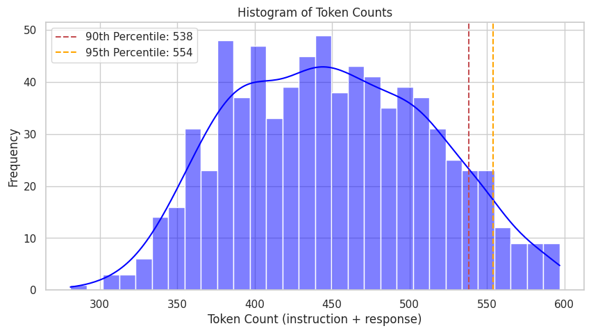

# Data Preparation for Domain-Specific Llama SFT

This document details the data preparation phase of the **Domain-Specific Llama SFT for Generative AI Q&A** project.

---

## Data Sources and Collection Strategy

My data collection strategy involved a dual approach to ensure comprehensive coverage and diversity within four key sub-topics in Generative AI: Prompt Engineering, Foundation Models, Agentic AI, and Responsible AI. This approach allowed for both leveraging existing knowledge and addressing specific content gaps.

1.  **Publicly Curated Datasets:**
    * I integrated a focused selection of high-quality Q&A pairs from publicly available datasets specifically suitable for for SFT.
    * These foundational data points were sourced primarily from **Hugging Face Datasets**.
    * The selection criteria rigorously emphasized data relevance, diversity of topics, and factual accuracy to ensure a robust baseline.

2.  **Synthetic Data Generation via Advanced Prompt Engineering:**
    * Recognizing the limited availability of extensive, pre-curated datasets for these specialized Generative AI topics, and given the manual extraction required from existing public sources, I prioritized **synthetic data generation** to significantly enrich the dataset. This process was executed using **AWS PartyRock**.
    * The systematic approach to generating informative Q&A pairs for each sub-topic followed a structured pipeline:  
        `Sub-topic` $\rightarrow$ `N Aspects` $\rightarrow$ `M Subjects` $\rightarrow$ `K Questions` $\rightarrow$ `K Answers` $\rightarrow$ `Q&A Format`
    * This generation was powered by **advanced prompt engineering techniques**, including Prompt Chaining, Few-shot Prompting, and Chain-of-Thought reasoning. These techniques were applied to a suite of advanced Large Language Models, specifically **Claude 3.5** and **Llama 3.1 Instruct 70B**.
    * The sophisticated prompts were designed to:
        * Generate novel and contextually relevant question-answer pairs tailored for specific scenarios within each sub-topic.
        * Create diverse linguistic paraphrases of existing questions and answers, thereby enhancing the dataset's robustness and the model's ability to handle varied phrasing.
        * Systematically expand on complex concepts related to Prompt Engineering, Foundation Models, Agentic AI, and Responsible AI, ensuring a deeper and broader understanding is encoded in the data.
    * This entire generation process was iterative, with prompts continuously refined based on the qualitative assessment of the generated output and subsequent manual review for accuracy and coherence.

---
## Data Cleaning & Preprocessing

The raw collected and synthetically generated data underwent a meticulous cleaning and preprocessing pipeline. This careful curation was essential to transform the raw information into **high-quality model input**, optimizing it for the Llama model's fine-tuning.

Sample Notebook for Data Cleaning and Preprocessing: [Notebook](./data_preprocessing.ipynb)

1.  **Format Validation and Transformation:**
    * All data was consistently transformed into a Question-Answer pair using the JSONL format, aligning with the expected input structure for Llama model SFT.
    * A JSONL-formatted example, where `"prompt"` is for the Question, `"completion"` for the Answer.
    ```json
    {"prompt": "What are the key ethical principles that should guide the development of responsible AI systems?", "completion": "Responsible AI development should be guided by principles including transparency, fairness, accountability, privacy protection, human oversight, non-maleficence (avoiding harm), beneficence (promoting good), and respect for human autonomy. These principles ensure AI systems serve humanity's best interests while minimizing potential risks."}

2.  **Special Token and Artifact Removal:**
    * A critical step involved **removing special tokens, control characters, and extraneous markdown/HTML artifacts** (e.g., Greek alphabets, mathematical formulas, `\n`, `\t`, `[CLS]`, `[SEP]`, `<a>` tags, or excessive punctuation) that could introduce noise or misinterpretations during training. Regular Expression was used for special characters and tokens removal.
    * Leading/trailing whitespace was consistently trimmed from all text fields.

3.  **Token Distribution Analysis:**
    * I conducted **analysis of token distribution** across the dataset, examining the length of questions and answers in terms of tokens.
    * This analysis aided in identifying and handling outliers:
        * Extremely short outliers were refined to have longer, more detailed answers.
        * Excessively long outliers were refined to have shorter, more concise answers.
    * This process also informed decisions regarding the optimal `max_input_length` hyperparameter, ensuring efficient batching and memory utilization during fine-tuning.
    * Example:  
        

4.  **Quality Curation and Validation:**
    * Beyond automated cleaning, the dataset underwent a careful curation process, including fact-checking using another LLM.
    * This validation step was crucial for verifying the factual accuracy, contextual relevance, and overall linguistic quality of a representative subset of the data, especially for synthetically generated examples.
    * Inconsistencies, factual errors, or low-quality examples identified during this phase were refined to be correct.
